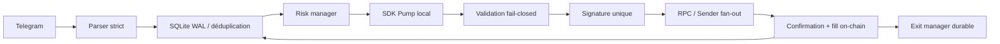

# KOL Sniper

Exécuteur de signaux Telegram → Pump.fun/Solana, conçu pour être rapide **et** refuser une transaction ambiguë.

## Ce qui change en v2

- `DRY_RUN=true` par défaut : aucun achat n'est possible sans activation volontaire.
- Déduplication, ordres, fills, positions et paliers de sortie persistés dans SQLite/WAL.
- Construction via les SDK officiels Pump et PumpSwap (bonding curve et tokens gradués), isolés du processus de signature en production.
- Fallback PumpPortal désactivé par défaut et chaque transaction distante est inspectée avant signature.
- Validation du payeur, du nombre de signataires, des programmes, du discriminant buy/sell et des transferts SOL.
- Fan-out des **mêmes octets signés** vers plusieurs RPC/Helius Sender, sans double signature.
- Confirmation et fill réels lus on-chain avant de créer une position.
- Limites d'exposition, de positions, d'ordres en vol et de perte journalière.
- Sorties durables : paliers, stop-loss, trailing stop et durée maximale, alimentés par un WebSocket partagé.
- Reprise après crash sans resoumission aveugle d'un ordre incertain.
- Santé et métriques sur `/health` et `/metrics`.

## Démarrage rapide

Prérequis : Python 3.10+ (3.12 recommandé) et Node.js 20+.

```bash
python3.12 -m venv .venv
.venv/bin/pip install --require-hashes -r requirements-dev.lock
npm ci
cp .env.example .env
.venv/bin/python sniper.py --check
.venv/bin/pytest
npm run check:builder
```

Test local sans clé ni achat :

```bash
.venv/bin/python sniper.py --dry-run-signal \
  "pump.fun/coin/4t1xhKJd6oFGr98oWJoxYjLU74eFe7xiYSRDoX18pump"
```

Puis renseigner Telegram dans `.env` et lancer :

```bash
.venv/bin/python sniper.py
```

Ne passer `DRY_RUN=false` qu'après les étapes de [SETUP.md](SETUP.md).

## Latence

La métrique `last_submit_latency_ms` mesure précisément : réception du message → parsing → déduplication → contrôle risque → build → validation → signature → première acceptation RPC. La confirmation est mesurée séparément dans `last_trade_latency_ms`.

Le pipeline local se benchmarke ainsi :

```bash
.venv/bin/python -m tools.benchmark -n 100
```

Ce benchmark n'inclut pas le SDK/RPC/réseau. L'objectif de 400–800 ms doit donc être validé sur le VPS de production avec de petits montants, un RPC géographiquement proche et les métriques réelles. Il n'est pas honnête de le garantir depuis un test hors-ligne.

## Rentabilité

Le code réduit le risque opérationnel, pas le risque de marché. Les données historiques du dépôt ne prouvent pas la rentabilité de l'automatisation actuelle : plusieurs sorties positives observées étaient manuelles/externes et les frais, le slippage, le MEV, les tokens invendables et les échecs de landing changent fortement l'espérance réelle.

Avant d'augmenter la taille : collecter au moins 100–300 trades confirmés avec `entry`, `exit`, frais, slippage, délai et drawdown; calculer l'espérance nette, le taux de réussite, le profit factor et le pire drawdown; n'augmenter que si les résultats restent positifs hors échantillon.

`python logger.py --json` expose désormais les agrégats issus uniquement des fills confirmés (`realized_pnl_sol`, `profit_factor`, taux de sorties profitables, drawdown réalisé et frais). Tant que l'échantillon est vide ou trop petit, la réponse honnête reste : rentabilité non démontrée.

## Architecture



Le déploiement est volontairement **mono-instance active** avec SQLite. Pour une réplication horizontale réelle, migrer les réservations/déduplications vers PostgreSQL et ajouter une élection de leader par portefeuille. Plusieurs instances actives partageant la même clé peuvent dépasser les limites de risque.

## Commandes utiles

```bash
.venv/bin/python logger.py                 # état durable
.venv/bin/python telegram_bot.py           # bot admin read-only optionnel
curl http://127.0.0.1:8787/health
curl http://127.0.0.1:8787/metrics
```

Voir [SECURITY.md](SECURITY.md) pour la rotation obligatoire des secrets exposés et [SCALING_PLAN1.md](SCALING_PLAN1.md) pour le passage à l'échelle.
